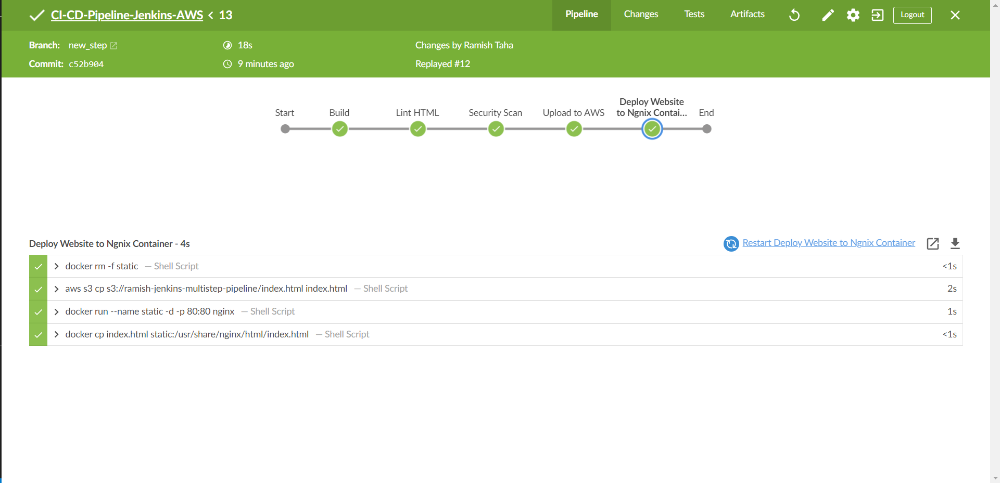
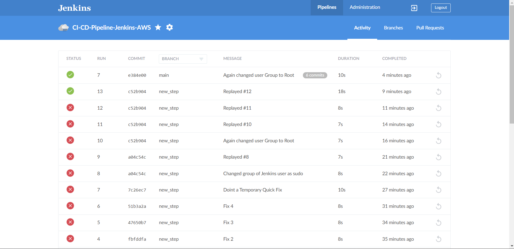

# Multistep Jenkins Pipeline on AWS

### This is a Multistep Pipeline in AWS which does Code Quality Scan, Security Scan and Deployment of Code.

# Stages in this pipeline
## There are a total of 5 Stages in this pipeline.
## Build
It's nothing like building going on here, It's just showing some outputs.
## Lint HTML
This stage Checks for the Errors in The Static HTML file, If there are any errors, It outputs Exit Code 1 and pipeline Stops. Else The pipeline continues.
> There are more used of Tidy, It also corrects the HTML files but Here I have just used it for checking the code.
## Security Scan
This stage Scans the Docker Image file for vulnerebilities and outputs it on the console.
> There's one functionality of this Stage which I commented because I could not find or build a proper Image file. It stops the pipeline if the Security Risks in the image file is of HIGH or CRITICAL.
## Upload to AWS
This Stage consists of uploading the Static HTML file which were Earlier checked for errors in the 2nd Stage. This STep uses a Plugin "Pipeline: AWS Steps" to do the task.
The region and credentials for Authorisation are provided.
> Here I have specified 'jenkins' in Credentials and I know you are wondering what 'jenkins' is. So actually I have Saved The AWS Credentials 'Access key ID' and 'Secret access Key' as global credentials with ID 'jenkins'.
## Deploy Website to Nginx Container
A lot of things are going on in this Step.
>* The previous Docker Nginx Container is Stopped and Deleted
>* The Static Files are copied from S3
>* A new Docker container is spinned up listining to port 80
>* The Static files are now copied to html folder in the container.

### Plugins I have Used
1. Blue Ocean
2. Config API for Blue Ocean
3. Events API for Blue Ocean
4. Git Pipeline for Blue Ocean
5. Github Pipeline for Blue Ocean
6. Display URL for Blue Ocean
7. Pipeline: AWS Steps

